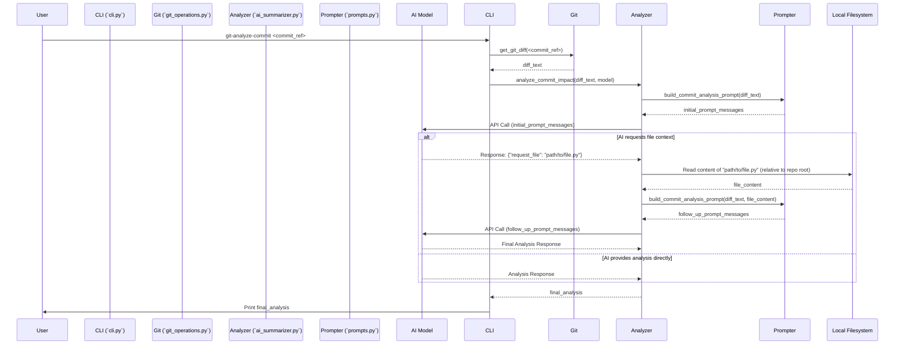

# AI-Assisted Git Commit Analysis Workflow Plan

**Goal:** Create a new workflow where an AI analyzes a git commit diff to determine if it's a 'clean refactoring' or poses a 'potential risk'. The AI should be able to request the full content of specific files mentioned in the diff for better context.

**Proposed Plan:**

1.  **New CLI Command:**
    *   Introduce `git-analyze-commit` in `git_summarize/cli.py`.
    *   Accepts a commit reference.
    *   Fetches the diff using `git_operations.py`.
    *   Calls a new analysis function in `ai_summarizer.py`.
    *   Handles the interaction loop for file requests.
    *   Displays the final analysis.

2.  **New Prompt Definition:**
    *   Add `build_commit_analysis_prompt` to `git_summarize/prompts.py`.
    *   Instructs AI to classify changes ('Clean Refactoring'/'Potential Risk') with justification.
    *   Specifies the JSON format `{"request_file": "path/to/file.py"}` for requesting file content if needed.

3.  **New AI Summarizer Function:**
    *   Create `analyze_commit_impact` in `AISummarizer` (`ai_summarizer.py`).
    *   Takes `diff_text` and `model`.
    *   Uses `build_commit_analysis_prompt`.
    *   Calls the AI model.
    *   **Interaction Handling:**
        *   If AI responds with `{"request_file": ...}`:
            *   Read the requested file content (relative to repo root).
            *   Construct a new prompt with diff + file content.
            *   Make a second AI call.
            *   Return the second result.
        *   Otherwise, return the initial analysis.

**Workflow Visualization:**

**Key Considerations:**

*   **Security:** Reading file content requested by the AI needs careful handling to ensure only files within the project repository are accessed.
*   **Error Handling:** Robust error handling is needed for Git operations, file reading, and AI API calls.
*   **AI Model Capabilities:** The effectiveness of the file request mechanism depends on the AI model's ability to follow the instruction to output the specific JSON format when needed.