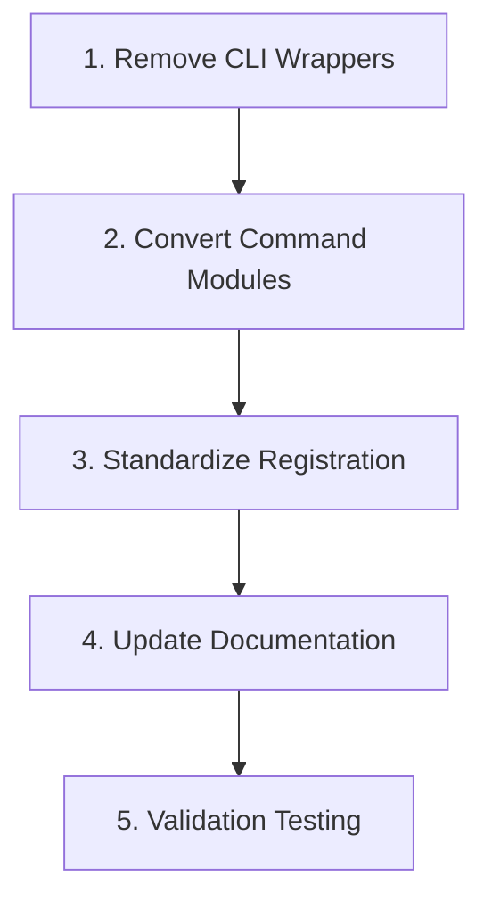

# Command Duplication Refactor Plan

## Problem Statement
Duplicate command implementations exist between:
- `cli.py` (registration + logic)
- Individual command modules (logic only)

## Solution Approach
1. **Separation of Concerns**
   - `cli.py`: Handle command registration only
   - Command modules: Contain full implementations

2. **Implementation Steps**


3. **Detailed Changes**
- `cli.py`:
  - Remove duplicate command functions
  - Directly import and register command implementations
- Command modules:
  - Add Typer parameter annotations
  - Include full command documentation

4. **Affected Files**
```python
[
    "cli.py",
    "commands/summarize_history.py",
    "commands/generate_report.py",
    "commands/feedback.py",
    "commands/analyze_commit.py (new)"
]
```

## Validation Plan
1. Run all affected commands with:
```bash
python -m git_summarize summarize-history
python -m git_summarize generate-report
python -m git_summarize git-feedback
```

2. Verify help documentation consistency:
```bash
python -m git_summarize --help
```

## Rollback Procedure
```bash
git checkout HEAD -- cli.py commands/