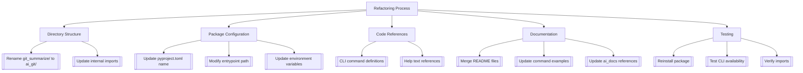

# AI-Git Refactoring Plan v2

## Combined Objectives
1. Rename CLI tool from `git-summarize` to `ai-git`
2. Rename directory structure from `git_summarize/` to `ai_git/`



## Implementation Strategy

### 1. Directory & Code Updates
```bash
# Rename root directory
mv git_summarize ai_git

# Update all Python imports (example)
sed -i 's/from git_summarize/from ai_git/g' ai_git/**/*.py
```

### 2. Package Configuration (pyproject.toml)
```toml
[project]
name = "ai-git"
# ...
[project.scripts]
ai-git = "ai_git.cli:app"  # Updated path
```

### 3. Environment Variables
```diff
- GIT_SUMMARIZE_DEFAULT_MODEL
+ AI_GIT_DEFAULT_MODEL
```

### 4. Documentation Sync
1. Merge `ai_git/README.md` into root README
2. Update all documentation references:
```diff
- git-summarize --help
+ ai-git --help
```

### 5. Validation Checklist
1. Reinstall package:
```bash
uv pip uninstall ai-git
uv pip install -e .
```
2. Verify functionality:
```bash
ai-git --list-models
python3 -c "from ai_git import __version__; print(__version__)"
```
3. Check documentation links in:
- ai_docs/rename_plan.md
- ai_docs/refactor_plan.md